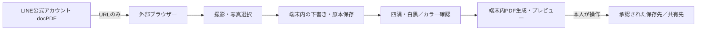

# docPDF｜LINE入口の企画・設計

更新: 2026-10-08。試作、未公開、実データ未使用。日付スキャンv2の本線とは別案。

## 目的と採用案

個人スマホで業務報告書を撮影し、読めるPDFにして勤務先が認めた方法で渡す。利用者が普段使うLINE公式アカウント「docPDF」を入口にする。

顧客の住所・名前があるため、初回試作はLINEトークへの写真送信やサーバー変換を採用しない。リッチメニューのURLアクションから外部ブラウザーを開き、既存の端末内処理アプリを使う。LIFF SDK、LINEログイン、プロフィール取得、Messaging API、Webhook、配信ボットは導入しない。作成済みのLINEログインチャネルは変更せず残す。

この選択はユーザーの2026-10-08の「OK」および製作依頼に基づく。LINEのアカウント作成・規約同意は本人が実施。公式アカウントが存在することだけで、業務で顧客情報を扱う許可があるとは判定しない。

## 本線との分離

- 基準: `lupisflora-n/R` / `codex/docscan-v2` / `8fe715f1504f3f47415b8c33c8e32896cec0b6ce`。
- 作業: `/workspace/R-line`、ローカルブランチ `codex/docpdf-line`。通常cloneはプロキシ接続失敗のためGitHub連携で固定コミットの90コード・資料・試験ファイルを取得し、全blob SHAを照合。過去の証拠はリモートに保持し、ローカルへコピーしていない。履歴は復元スナップショットの新規ローカル履歴であり、リモートの祖先履歴と同一ではない。`SOURCE_BASE.json`に出自を記録。
- 本線のブランチ、公開済み `docscan-v2-test.pages.dev`、その利用者データは変更しない。
- 配布は**新しい専用originを必須**とし、既存サイトへの上書きは禁止。このビルドはルート配信を前提にする。
- DB名・schemaは既存コードを継承。別originのため別の保存領域となる。本線の文書は自動移行しない。移す場合は勤務先の確認後に本人がバックアップを明示的に扱う別作業。

## 利用経路

リッチメニューは左右2つ。左は「書類をPDFに／ブラウザーで開く」、右は「使い方・安全」。素材は `design/line/rich-menu.png`（2500×843、PNG、1MB未満）。テンプレート・アクション設定は `DOCPDF_LINE_SETUP.md`。

左のURLは公開後の固定originに `/?openExternalBrowser=1` を付ける。これは通常のウェブURL用のLINE仕様であり、LIFF URLへのパラメーター追加ではない。端末の既定ブラウザーは利用者設定に依存する。Chrome/Safari以外を絶対に起動できない、とは説明しない。

LINE内でルートを開いた場合、User-Agentの `Line/` を判定し、JSZip・文書アプリ・DBを読み込む前に切替案内を表示する。URLフラグでこの案内を解除しない。案内には撮影・ファイル入力を置かず、外部ブラウザー用リンク、個人情報を含まないトップURL、コピー・手動貼付の救済を用意する。

UA判定はUIの補助であり、認証・OSの保証・悪意あるコードに対するセキュリティ境界ではない。LINEがUAを変更した場合は判定が外れ得るので、実機で確認し、文書アプリにも「LINEトークへ書類を送らない」と表示する。OSの外部ブラウザー起動は実機ゲート。

## 実装範囲

撮影／写真選択→下書き保存→四隅の透視補正→カラー／白黒確認→編集保存→同じ日付で1〜10枚選択→PDF生成→実PDFプレビュー→別クリックのFile共有／端末保存。日付ZIPの検査・追加復元、原本保全、書込み世代、作業後の更新を継承する。原本、文字、印影を生成補完しない。

- `/`: `src/entry.ts`がLINE判定後にアプリを動的読込。
- `/line`（`line.html`）: 書類を取り込まない入口・切替案内。
- `/help`（`help.html`）: 操作手順、保存領域、共有と通信、個人スマホの注意。文書処理・ログインなし。
- 入口URLは現在のoriginのルートから組立て、クエリ・fragment・リダイレクト指定を継承しない。
- Service Workerは各HTMLとCloudflareの拡張子なしcanonical URLを対応づける。全経路をアプリHTMLへ置換しない。作業中の強制更新は追加しない。

## データとリスク

| 対象 | 経路／制限 |
|---|---|
| 書類写真・PDF | 端末のブラウザー内。コードにアップロード機能なし。本人の保存／共有先にはコピーが渡る |
| LINE | 起動URLの入口。トークへ実書類を送る運用は対象外。友だち追加などLINE自身の取扱いはLINE側の規則に従う |
| 静的配信 | アプリ資源・更新のGET通信。配信事業者のアクセス情報が発生し得る。通信ゼロを保証しない |
| ブラウザー保存 | 暗号化はOS／ブラウザーの保護に依存。独自暗号化、永久保存、自動消去なし |
| 復元ZIP | 原本・編集・PDFを含み、暗号化なし。勤務先が認めた場所だけで扱う |
| 端末のカメラ | 写真アプリ側の自動クラウドバックアップはアプリ外。OS・撮影方法ごとに本人が確認 |
| 更新・依存 | 新コードは端末内文書へアクセスできる。公開権限・差分レビュー・同梱ハッシュ・CSPを維持 |

顧客名・住所・書類画像を解析タグ、ログ、CI、AIへ送らない。開発検査は合成データだけ。HTTP書込みや外部ホスト参照がないことをソース／ビルドで検査するが、ブラウザーの通信検査・配信ヘッダーの実測と区別する。

個人スマホでの業務利用を認める勤務先の確認、送信先、保存先、保存期間・削除手順は実務投入条件。現時点で確認済みとは記録しない。LINE接続をやめても端末紛失・誤送信・バックアップ・コード更新のリスクは残る。

## 費用と公開

既存の同梱依存のみ。実行用LINE APIや動的サーバー、アカウント基盤、有料API、ストア登録は追加しない。新規Cloudflare Pages無料静的配信を候補とする。無料枠の適用・有料機能を使わないことを公開時に確認する。

新しい検証サイト・独立ブランチへの外部反映は完成したパッケージを示して承認範囲を確定する。本線の公開承認を別サイトの公開承認と混同しない。実際の公開URLは未取得。想定プロジェクト名 `docpdf-line-test` は候補であり、作成済みとは扱わない。

## 受入条件

| 項目 | 合格条件 |
|---|---|
| L01 LINE入口 | 実AndroidのdocPDFメニューから外部ブラウザーへ移る。遷移前に書類を取込まない |
| L02 1枚経路 | 架空紙の小数点・薄字・紙全体が原本とPDFに残り、保存・メール添付・受信確認できる |
| L03 原本保全 | 再起動後の下書き・原本・編集・PDF保持。別起動形態を同一保存領域と決めつけない |
| L04 通信 | 入口→撮影→PDFのブラウザー記録に書類のHTTP送信・外部解析がない。手動共有は別に記録 |
| L05 更新 | 入口・使い方・アプリがオフラインで別経路を保ち、作業中更新しない。旧→新の原本保持は別ゲート |
| L06 両OS | Android ChromeとiPhone Safariそれぞれ実LINE・カメラ・保存・添付を確認。iPhone未検証を合格としない |
| L07 業務利用 | 勤務先が認めた個人端末・保存先・送信先・保存期間の確認と、全関連実機ゲートの合格 |

今は一般提供・実務利用NO-GO。ローカル合成検査、ブラウザー検査、実機検査を別々に報告する。

## 根拠（2026-10-08確認）

- [LINE URLスキーム・外部ブラウザー](https://developers.line.biz/ja/docs/messaging-api/using-line-url-scheme/)：通常URLの `openExternalBrowser=1`、LIFF URLでは非対応。
- [公式リッチメニュー作成手順](https://www.lycbiz.com/jp/manual/OfficialAccountManager/rich-menus/)：管理画面のURLアクション、画像形式・寸法、アクションラベル。
- 既存 `PROJECT_BIBLE.md`、`DATA_AND_BACKUP.md`、`IMAGE_PDF_SHARE.md`、`RELEASE_AND_COST.md` の端末内処理・原本保全・公開境界を継承。
